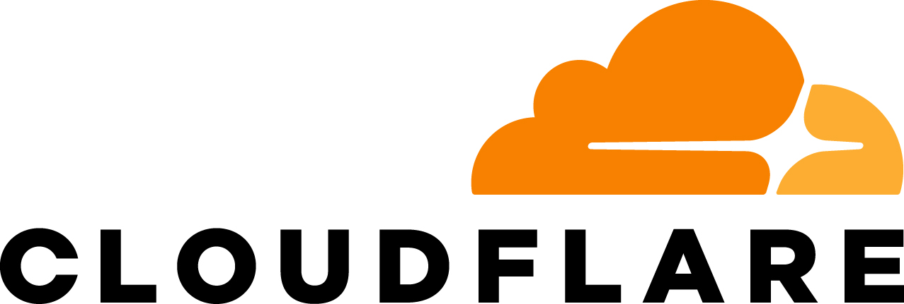

# Deploy a production-ready, real-time web-app for 0$/month & no account

## TLDR

The web-app is deployed Cloudflare Pages and uses Convex as database.
Stack: Vite+, Tanstack Router, Tailwind, ShadCN (BaseUI)

"notermd" organization name was choose with "-" because default Android keyboard makes it hard typing a "-".

We need just 1 `CONVEX_DEPLOY_KEY` for **Production** and one for **Preview**,
That way each PR has it's own link and database different from a Production/Dev databases.

Then we use OpenAI Codex Cloud to make some changes;
But you can use anything you want, there are instructions for running it locally and in git worktrees since Codex supports that from the start.
Since you already have Cloudflare you can use Cloudflare Tunnels instead of grok so you can share even server running on personal machine. This implies that it's easily extendable to support external server that can be accessed by exposing a single port (we can expose Convex through Vite so no need for 2 ports).

## 1: Create Github, Convex, Cloudflare & OpenAI accounts

Start with **a Google or an Apple** account on a **phone or desktop**

- [ ] **1: Create Github using Google/Apple :** https://github.com/ 
       
      GitHub by Microsoft is the place where engineers store their code.
- [ ] **2: Create Convex using Github :** https://www.convex.dev/ 
       
      Convex is the best database I have personally used. The simplicity of my stack proves how good it is. It also has its own Node server.
- [ ] **3: Create CloudFlare using Github :** https://www.cloudflare.com/ 
       
      Your frontend code is deployed as static files.
      Ensures the safety of your app and users
- [ ] **4: Create an OpenAI using Google/Apple :** https://openai.com/ 
       
      We'll rely on Codex Cloud to make changes to the code.
      But i usually use Codex locally (there are later instructions for that)

It's fine if you signed up differently, as long as you have these 4 accounts you can deploy an app.

      
Step 1: Android Video recording

https://github.com/user-attachments/assets/5a50a24f-d50d-4f6f-9c89-0a64995adc90

## 2: Copy the app code to your GitHub account

Visit https://github.com/notermd/app

- [ ] click big green "Use this template"
- [ ] make it private or leave it public

Phone recording of using the template

https://github.com/user-attachments/assets/2bf41c78-c6b8-4850-a6ab-1a3dbfbbbf05

"Fork" if you want to preserver the git history

Check the full Git History here: https://github.com/notermd/app/commits/main/

It is manually made so it's as small, clear and simple as possible.

"Use this template" is nicer because the button is green but it squashes the whole history inside a single commit, so it makes it a bit harder for AI to understand it.

## 3: Connect Cloudflare Pages to Github

Cloudflare Pages will automatically deploy your app whenever the code changes on GitHub.

You need to do this only once and afterwards you'll be able to create as many apps as you want.

But it's a bit tricky since the Cloudflare side sometimes has issues.

- [ ] Access _Cloudflare Pages_ from the sidebar "Compute > Workers & Pages"
- [ ] Click "Create Application"
- [ ] Click "Connect to GitHub" to `Install & Authorize Cloudflare Workers & Pages`

It's not clear what the issue is, but very often, Cloudflare doesn't notice that the connection already exists.

Try opening Cloudflare Pages from a Desktop instead of Mobile, this usually helps.

https://github.com/user-attachments/assets/d18ddb8e-7a5b-49bc-9b80-b8d00d6dd671

Connecting CloudFlare Pages to Github issues

Cloudflare Workers & Pages sometimes has issues after installing, you can wait a bit.
You can also go to github "Settings > Applications > Authorized GitHub Apps" to remove or revoke the installed apps, and try doing it again from Cloudflare.

You can check all your installed GitHub apps here: https://github.com/settings/installations

## 4: Create a Convex project and a CONVEX_DEPLOY_KEY

- [ ] Visit https://dashboard.convex.dev/
- [ ] Click "+ Create Project" and give whatever name
- [ ] Click the pill on the top to view your Production deployment (you may need to click twice)
- [ ] Click "+ Create Deploy Key", you'll need it to connect to Cloudflare, so don't press "Done" yet

If you press "Done" you won't be able to see the deploy key again, but it's fine, you can delete it and create a new deploy key.

### What are CONVEX_DEPLOY_KEY?

They are a sort of password used between servers.
In our case it is used by Cloudflare to update the database on each change.

Step 4: Video Android

      
https://github.com/user-attachments/assets/d37ceeed-32c6-47e5-8d66-1cfef2ac60c0

## 5: Create a Cloudflare Pages Deploy

- [ ] Access _Cloudflare Pages_ from the sidebar "Compute > Workers & Pages"
- [ ] Click "Create Application"
- [ ] **Make sure you click "Get Started" at the bottom** so you create "Pages" and not "Workers"!
- [ ] Set `Build Command` to `pnpm build:cloudflare`
- [ ] Set `Build output directory` to `dist`
- [ ] Add Environment Variable `CONVEX_DEPLOY_KEY` and use the Production deploy key from the previous step

Step 5: Video Android

      
https://github.com/user-attachments/assets/c57eb076-45c8-49f4-b232-eda605b3eace

---

🚀🚀 Congrats, you shipped your first app 🚀🚀

Any change that you make to the `main` branch in your github repo, will be deployed automatically.

## 6: Connect Codex to GitHub

OpenAI Codex uses the same connection method as Cloudflare so you might encounter some issues, but need to do it just once.

## 7: Get a separate deployment for each change

You were seeing errors in the Pull Requests because the cloudflare deploys a preview and it cannot connect to your production database.
To solve this, you can create a "Preview Deploy Key" from Convex and set it to Cloudflare, that way each Pull Requests will have it's own database.

- [ ]

## 8: Deleting the app

To delete an app you deployed you'll have to

- [ ] Delete Cloudflare Pages app
- [ ] Delete Convex project
- [ ] Delete GitHub repository

## 9: Create an app in a single step using noter.md

noter.md connects with Github, Cloudflare & Convex once,
then allows you to create an app with a single click of a button
It also allows you to completely removed as easily.

So apps become disposable, you can create an app and to create a game and use it for night-out with your friends

- OR -

you can decide to continue maintaining it and based your business on it since it's

### Why is noter.md free?

I already have this functionality and much more for my own apps, it doesn't cost me much to share it with everybody.
If you want more things, like editing files on the go, monitoring multiple apps or multiple branches of the same app, then
it starts costing me more so that's not released yet.
